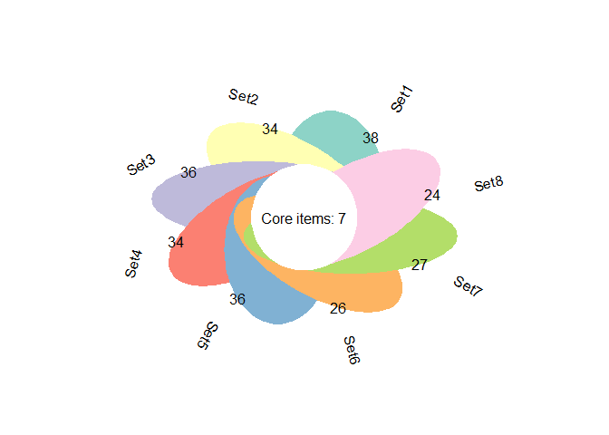

<!-- README.md is generated from README.Rmd. Please edit that file -->

# generankplot

<!-- badges: start -->

<!-- badges: end -->

The goal of flowerplot is to draw flower plot.

## Installation

You can install the released version of flowerplot from
[GitHub](https://github.com/dongwei1220/flowerplot) with:

``` r
devtools::install_github("dongwei1220/flowerplot")
```

## Example

This is a basic example which shows you how to solve a common problem:

``` r
library(flowerplot)
#> Loading required package: plotrix
#> Warning: package 'plotrix' was built under R version 3.6.3
#> Loading required package: RColorBrewer

## basic example code
data(flower_dat)
head(flower_dat)
#>      Set1   Set2  Set3  Set4   Set5    Set6   Set7     Set8
#> 1   ZMIZ1  ADCY5  TNS1  TNS1   TNS1   ZMIZ1 SORBS1     RGS3
#> 2    TNS1  ACTN4 ZMIZ1 ZMIZ1  ZMIZ1    TNS1   TNS1    FHOD3
#> 3   CASZ1 SORBS1  RXRA  RXRA TSPAN9   CASZ1  ZMIZ1 PPARGC1B
#> 4    NFIC   TNS1 AHDC1 NCOR2   MIDN    NFIC  RBM20     NNMT
#> 5 CACNA1C  ZMIZ1 ACTN4  MIDN  NCOR2 CACNA1C TSPAN9   SORBS2
#> 6   AHDC1  RBM20  MIDN AHDC1  AHDC1   AHDC1  SYNPO   FAM53B

flowerplot(flower_dat)
```


``` r
flowerplot(flower_dat, a = 0.5, b = 2, r = 1,
           circle_col = "red", ellipse_col_pal = "Spectral",
           label_text_cex = 1)
```


``` r
flowerplot(flower_dat, angle = 60, ellipse_col_pal = "Set3")
```



In that case, don’t forget to commit and push the resulting figure
files, so they display on GitHub and CRAN.
